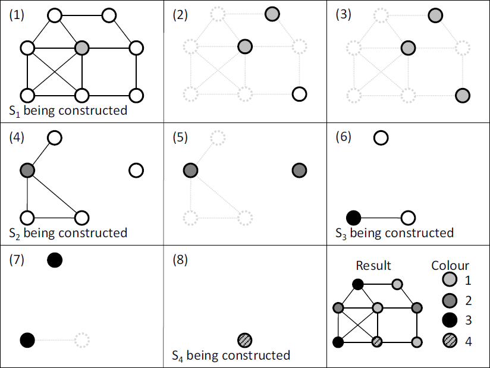

```{r setup, include=FALSE}
knitr::opts_chunk$set(echo = FALSE)
```

#Introdução
## Descrição do Problema
Seja um grafo $G=(V,E)$ com $n$ vértices $\in V$ e $m$ arestas $\in E$. O problema de coloração de grafos consiste em atribuir a cada vértice $v \in V$ um inteiro $c(v) \in \{1,2,..,k\}$ em que:  


- $c(v) \neq c(u) \,\forall\, \{v,u\} \in E$.
- $k$ é mínimo.

Um exemplo:  

<center>{width=800px}</center>

----

### Observações:

- Supõe-se que o grafo $G$ é **conexo**.
- $G$ é **simples**.
- Serão apresentados problemas relacionados à **coloração dos vértices**.

É importante tratar o problema de coloração de grafos como um tipo de **problema de partição dos vértices** ,a partir de restrições (presença de aresta), no qual uma solução $S$ é representada por $k$ grupos:  
$S= \{S_1,S_2,...,S_k\}$

## Aplicações:
- Colorir mapas;
- Resolver jogos *Sudoku*;
- Construção de Horários (para aulas, eventos, etc);
- Construção de escalas (para taxis, ônibus, etc);
- Alocação de assentos em eventos;
- Verificar se um grafo é bipartido;
- Entre outros problemas que podem ser abordados como problemas de coloração de grafos.

## Definições

- Uma coloração é **possível** se, e somente se, todos os vértices $v$ estão associados a uma cor e vértices adjacentes não tenham a mesma cor.
- O **número cromático** de um grafo é $\chi(G)=k$ mínimo. Uma coloração **possível** de $G$ usando exatamente $\chi(G)$ cores é considerada **ótima**.
- Uma **classe de cor** é um conjunto $\{v \in V:c(v)=i\}$.
- Um **conjunto independente** é um subconjunto de vértices $I\subseteq V$ tal que $\forall \, u,v \in I, \{u,v\}\notin E$.
- Um **clique** é um subconjunto de vértices $C \subseteq V$ tal que $\forall \, u,v \in C, \{u,v\}\in E$.
- A **vizinhança** de um vértice $v$ é dada por $\Gamma(v)=\{u \in V: \{u,v\}\in E\}$.
- O **grau** de um vértice $v$ é $deg(v)=||\Gamma(v)||$

## Complexidade do Problema

Em geral, encontrar uma coloração ótima para um grafo $G$ é um problema NP-difícil.

$\Rightarrow$ **Solução:** Algoritmos Construtivos, Heurísticos ou Meta-Heurísticos.

- Esses algoritmos encontrarão **soluções subótimas**.
- Dependendo do grafo $G$ e do algoritmo escolhido a solução pode ser boa ou ruim.
- Ainda assim, para determinados tipos de grafos, é fácil encontrar uma solução ótima.

## Grafos Completos
Dado um grafo completo com $n$ vértices, $K_n$:

- $\forall \,\, u,v \in V(K_n), \{u,v\} \in E(K_n)$.  
- É fácil ver que $\chi(K_n)=n$

Coloração ótima dos grafos $K_1, K_2, K_3, K_4 \,e\, K_5$ respectivamente:

<center>{width=800px}</center>

----

### R: igraph package - Grafos Completos $\Rightarrow \chi(K_n)=n$

```{r message=FALSE, warning=FALSE}
library(igraph)
```
```{r message=FALSE, echo=TRUE}
g <- make_full_graph(5)
```
```{r, fig.width=2, fig.height=2, fig.align='center'}
par(mar=c(0,0,0,0)) ; plot(g, edge.color="black")
```
```{r message=FALSE, echo=TRUE}
length(max_cliques(g)[[1]]) == length(V(g)) #O grafo é completo?
length(V(g)) #Nº cromático
```

## Grafos Bipartidos
Dado um grafo bipartido $G=(V_1,V_2,E)$:

- Se $u,v \in V_i \,\,\forall\,\, i=1,2$; então $\{u,v\} \notin E$
- É fácil ver que $\chi(G)=2$

Coloração ótima para alguns exemplos de grafos bipartidos:

<center>{width=800px}</center>

$\Rightarrow$ Se $\chi(G)=2$, o grafo $G$ é Bipartido.

----

### R: igraph package - Grafos Bipartidos $\Rightarrow \chi(G)=2$
```{r message=FALSE, echo=TRUE}
g <- make_bipartite_graph( rep(0:1,length=10), c(1:10))
```
```{r, fig.width=2, fig.height=2, fig.align='center'}
par(mar=c(0,0,0,0)) ; plot(g,layout=layout.bipartite, edge.color="black")
```
```{r message=FALSE, echo=TRUE}
bipartite.mapping(g)$res #Grafo é bipartido?
```

## Grafos Cíclicos
Dado um grafo cíclico com $n\geq3$ vértices, $C_n$:

- $V(C_n)=\{v_1,...,v_n\}$
- $E(C_n)=\{\{v_1,v_2\},\{v_2,v_3\},...,\{v_{n-1},v_n\},\{v_n,v_1\}\}$
- É fácil ver que se $n$ é par: $\chi(C_n)=2$; se $n$ é ímpar: $\chi(C_n)=3$

Coloração ótima para os grafos $C_3,C_4,C_8 \,e\, C_9$ respectivamente:

<center>{width=800px}</center>

----

### R: igraph package - Grafos Cíclicos $\Rightarrow \chi(C_{par})=2$ ; $\chi(C_{impar})=3$

```{r message=FALSE, echo=TRUE}
g <- graph.ring(10)
```
```{r fig.width=2, fig.height=2, fig.align='center'}
par(mar=c(0,0,0,0)) ; plot(g, edge.color="black")
```
```{r message=FALSE, echo=TRUE, fig.width=2, fig.height=2}
girth(g)$girth == length(V(g)) #Grafo é cíclico?
length(V(g)) #Se par: Nº cromático = 2, Se ímpar: Nº cromático = 3
```

# Algoritmos Construtivos

## Algoritmo GREEDY

Toma-se um vértice por vez a partir de uma sequência e atribui-se a primeira *cor* disponível a ele.  
Passo a passo com sequência = $v_1, v_2,..., v_8$:

<center>{width=600px}</center>

----

### R: igraph package - Algoritmo GREEDY

```{r echo=TRUE, message=FALSE}
library(igraph)

vertex.color.greedy <- function(g, seq=V(g)){
    grps <- list()
    for(i in seq){
      if(length(grps)==0){grps[[1]]<-i}else{
        for(j in 1:length(grps)){
          if(sum(grps[[j]]%in%neighbors(g,i))==0){grps[[j]]<- c(grps[[j]],i);break}
        }
        if(sum(i%in%unlist(grps))==0){grps[[(length(grps)+1)]] <- i}
      }
    }
  grps2 <- list(no._de_grupos=length(grps),grupos=grps)
  return(grps2)
}
```


----

- O Algoritmo *GREEDY* produz sempre e rapidamente uma solução **possível**. No entanto pode ser pobre quanto ao número de grupos formados em relação a $\chi(G)$.

###Teorema:
Seja $S$ uma solução **possível** para $G$. Se cada classe de cor $S_i \in S$ é considerada por vez no algoritmo *GREEDY*, a solução resultante $S'$ será tal que $|S'| \leq |S|$.

**Exemplo:**  

- Sequência: $S=\{S_1,S_2,S_3,S_4\}=\{\{v_1,v_5,v_6\},\{v_2,v_3,v_8\},\{v_4\},\{v_7\}\}$.  

No pior dos casos:  
$S'_1=\{v_1,v_5,v_6\}$  
$S'_2=\{v_2,v_3,v_8\}$  
$S'_3=\{v_4\}$  
$S'_4=\{v_7\}$  
$|S'|=|S|$  

$\Rightarrow$ GREEDY pode obter solução ótima.

----

### R: igraph package - Algoritmo GREEDY [Versão Alternativa]

```{r, echo=TRUE}
vertex.color.greedy.2 <- function(g, seq=V(g),times=1){
  n=0
  while(n<times){
    grps <- list()
    for(i in seq){
      if(length(grps)==0){grps[[1]]<-i}else{
        for(j in 1:length(grps)){
          if(sum(grps[[j]]%in%neighbors(g,i))==0){grps[[j]]<- c(grps[[j]],i);break}
        }
        if(sum(i%in%unlist(grps))==0){grps[[(length(grps)+1)]] <- i}
      }
    }
    for(i in 1:length(grps)){
      if(length(grps[[i]])>1){grps[[i]] <- sample(grps[[i]])}
    }
    seq <- unlist(sample(grps),use.names = F)
    n=n+1
  }
  
  grps2 <- list(no._de_grupos=length(grps),grupos=grps)
  return(grps2)
}
```

## Pacote 'tmaptools': GREEDY

```{r}
set.seed(21)
```
```{r echo=TRUE, message=FALSE, warning=FALSE}
g <- erdos.renyi.game(10, 20, "gnm")
g1 <- as_adj_list(g)
library(tmaptools)
tmap.col <- map_coloring(g1, algorithm = "greedy", minimize=TRUE) ; tmap.col
```
```{r, fig.align='center', fig.width=3, fig.height=3}
par(mar=c(0,0,0,0))
plot(g, vertex.color=c('red','blue','green','yellow')[tmap.col], edge.color="black", vertex.label.color="black")
```


## Pacote 'RBGL': GREEDY
```{r}
set.seed(69)
```
```{r echo=TRUE}
g <- erdos.renyi.game(15, 30, "gnm")
class(g)
```
```{r echo=TRUE, eval=FALSE, message=FALSE}
library("BiocManager")
BiocManager::install("RBGL", version = "3.8")
```
```{r echo=TRUE}
g1 <- graph::graphAM(get.adjacency(g, type="both", sparse = F),edgemode = "undirected")
class(g1)
```

## Pacote 'RBGL': GREEDY
```{r echo=TRUE}
RBGL::sequential.vertex.coloring(g1)
vertex.color.greedy(g)$grupos
```

#Limites para $\chi (G)$

## Limite Inferior

- Se o grafo $G$ possui subgrafo completo *(clique)* $K_h$, logo $\chi(G) \geq h$.

<center>{width=600px}</center>

## Limite Superior

- Se o grafo $G$ tem grau máximo $\Delta(G)$, isto é, $\Delta(G)=max\{deg(v): v \in V\}$. Então $\chi(G) \leq \Delta(G)+1$.

**Prova:** *GREEDY*  
Considere o i-ésimo vértice na sequência $v_i$. No pior dos casos, esse vértice tem $\Delta(G)$ vizinhos e cada um deles já está em um grupo de cor diferente, ou seja, já se tem $\Delta(G)$ classes de cor formadas. Então cria-se mais uma classe de cor para $v_i$. Tem-se então $\Delta(G)+1$ classes de cor.

----

### R: igraph package - Limites para $\chi(G)$ $\Rightarrow 3 \leq \chi(G) \leq 5$

```{r}
set.seed(69)
```
```{r, echo=TRUE}
g <- sample_gnm(10,15,directed = F,loops = F)
```
```{r fig.width=2, fig.height=2, fig.align='center'}
par(mar=c(0,0,0,0)) ; plot(g, edge.color="black")
```
```{r, echo=TRUE}
max(sapply(cliques(g),length)) #chomatic number >= 3
max(degree(g)) + 1 #chomatic number <= 5
```

## Algoritmo DSatur

Algortimo similar ao *GREEDY*.  
**Diferença:** Geração da ordem dos vértices prioriza vértices com menor número de opções de cores disponíveis.

- O **grau de saturação** de um vértice $v \in V$ tal que $c(v)=NULL$ é dado por: $sat(v)=||c(u):u \in \Gamma(v) \wedge c(u) \neq NULL||$.

Em cada iteração do algoritmo escolhe-se o vértice, não colorido, com maior grau de saturação. Em caso de igualdade, escolhe-se o de maior grau. Em caso de novo empate, sorteia-se aleatoriamente.

Inicialmente, todos os vértices tem $sat = 0$, então começa-se com o vértice de maior grau.

----
###Passo a Passo:

<center>{width=700px}</center>

----

### R: igraph package - Algoritmo DSatur
```{r, echo=TRUE}
vertex.color.dsatur <- function(g){
  grps <- list()
  verts <- V(g)
  d.satur <- rep(0,times=length(verts))
  while(length(verts)!=0){
    d <- data.frame(as.vector(verts),d.satur,deg=degree(g,verts))
    seq <- d[order(d$d.satur,d$deg,decreasing=T),1]
    for(i in seq){
      if(length(grps)==0){grps[[1]]<-i;verts<-verts[verts!=i]}else{
        for(j in 1:length(grps)){
          if(sum(grps[[j]]%in%neighbors(g,i))==0){grps[[j]]<- c(grps[[j]],i);verts<-verts[verts!=i];break}
        }
        if(sum(i%in%unlist(grps))==0){grps[[(length(grps)+1)]] <- i;verts<-verts[verts!=i]}
      }
    }
    d.satur <- c()
    for(i in verts){
      s <- 0
      for(j in grps){
        if(sum(j%in%neighbors(g,i))>0){s <- s+1}}
      d.satur <- c(d.satur,s)}}
  grps2 <- list(no._de_grupos=length(grps),grupos=grps)
  return(grps2)}
```

## Algoritmo RLF

**Estratégia Diferente:** Forma-se uma classe de cor por vez.  
No i-ésimo passo a classe de cor $S_i$ é construída: inicialmente um vértice $v$ é selecionado e adicionado à classe de cor. Então, dentre os vértices restantes que podem ser adicionado à classe, escolhe-se o próximo vértice. O algoritmo prossegue até não se ter mais opções de vértices. No próximo passo a classe $S_{i+1}$ é construída.  

- A escolha dos vértices quando se tem mais de uma opção disponível é feita aleatoriamente.

----
###Passo a Passo:

<center>{width=700px}</center>

----

### R: igraph package - Algoritmo RLF

```{r, echo=TRUE}
vertex.color.RLF <- function(g){
  grps <- list()
  while(sum(V(g)%in%unlist(grps))!=length(V(g))){
    X <- V(g)[!V(g)%in%unlist(grps)]
    grp.new <- c()
    while(length(X)>0){
      if(length(X)==1){v<-X}else{v <- sample(X,1,replace=F)}
      grp.new <- c(grp.new,v)
      X <- X[X!=v]
      X <- X[!X%in%neighbors(g,v)]
    }
    grps[[length(grps)+1]] <- grp.new
  }
  grps2 <- list(no._de_grupos=length(grps),grupos=grps)
  return(grps2)
}
```

# Exemplo

## Colorindo o Brasil

<center>{width=550px}</center>

----

### Grafo do Brasil

```{r, fig.align='center'}
brasil_map <- graph.formula(AM-AC:RR:RO:PA:MT, AC-RO, RR-PA, RO-MT, PA-AP:MT:TO:MA, TO-MT:GO:MA:PI:BA,
                            DF-GO:MG, MT-GO:MS, GO-MS:BA:MG, MS-MG:SP:PR, MA-PI, PI-CE:PE:BA, RN-CE:PB,
                            CE-PB:PE, PB-PE, PE-AL:BA, AL-SE:BA, SE-BA, BA-MG:ES, ES-MG:RJ, MG-RJ:SP,
                            RJ-SP, SP-PR, PR-SC, SC-RS)

set.seed(88)
par(mar=c(0,0,0,0))
plot(brasil_map, vertex.shape="rectangle", edge.width=5, edge.color="black",
       vertex.color="darkblue", vertex.label.color="white")
```

----

### Limites para $\chi(G)$

```{r, echo=T}
c(lower=max(sapply(cliques(brasil_map),length)), upper=max(degree(brasil_map)) + 1)
```

$3 \leq \chi(G) \leq 9$

----

### GREEDY

```{r}
set.seed(1)
```

```{r, echo=TRUE}
brasil.greedy <- vertex.color.greedy(brasil_map, sample(V(brasil_map)))
brasil.greedy
```

----

### DSatur

```{r}
set.seed(9)
```

```{r, echo=TRUE}
brasil.dsatur <- vertex.color.dsatur(brasil_map)
brasil.dsatur
```

----

### RLF

```{r}
set.seed(100)
```

```{r, echo=TRUE}
brasil.rlf <- vertex.color.RLF(brasil_map)
brasil.rlf
```

----

### GREEDY Alternativo

```{r}
set.seed(1)
```

```{r, echo=TRUE}
brasil.greedy2 <- vertex.color.greedy.2(brasil_map, sample(V(brasil_map)), times=10)
brasil.greedy2
```

----

### Pacote 'tmaptools' - GREEDY

```{r}
set.seed(3)
```

```{r echo=TRUE}
brasil_map2 <- as_adj_list(brasil_map)
brasil.tmap <- map_coloring(brasil_map2, algorithm = "greedy", minimize = TRUE)
brasil.tmap
max(brasil.tmap)
```

----

### Coloração RLF

```{r, fig.align='center'}
cores <- c("red","blue","green","yellow")
for(i in 1:brasil.rlf$no._de_grupos){
  V(brasil_map)$color[V(brasil_map)%in%brasil.rlf$grupos[[i]]] <- cores[i]
}
set.seed(88)
par(mar=c(0,0,0,0))
plot(brasil_map, vertex.shape="rectangle", edge.width=5, edge.color="black", vertex.label.color="black")
```

----

### Coloração 'tmaptools'

```{r, fig.align='center'}
set.seed(88)
par(mar=c(0,0,0,0))
plot(brasil_map, vertex.shape="rectangle", edge.width=5, edge.color="black", vertex.label.color="black", vertex.color=cores[brasil.tmap])
```

# Comparação dos Algoritmos

##Comparação Empírica dos Algoritmos em C++
Gerou-se aleatoriamente grafos variando o número de vértices e a densidade. Observou-se a performance dos algortimos tanto em custo computacional quanto no número de cores da solução.

- Em geral, para grafos com grande número de vértices, o algoritmo *RLF* produz resultados com menor número de cores. Contudo, é o mais custoso computacionalmente.
- O algoritmo *DSatur* produz, em geral, melhores soluções do que o *GREEDY*, e o custo computacional de ambos foi equivalente.

<center>{width=800px}</center>
*Sumário dos resultados produzidos pelos 3 algoritmos ao se gerar 50 grafos para diferentes tamanhos e densidade de 0.5.*

##Compração Empírica dos Algoritmos em R

<center>{width=1000px}</center>

----

<center>{width=1000px}</center>

----

<center>{width=1000px}</center>

#Outros Algoritmos

## Algoritmos mais Avançados
### Algoritmos Exatos:  
Sempre obtêm solução ótima (sem tempo limite de execução ou outro critério de parada).

### Algoritmos heurísticos e meta-heurísticos: 

- São adaptáveis a diferentes problemas.  
- Frequentemente apresentam bons resultados para grafos com grande número de vértices.

$\Rightarrow$ São apresentados diversos algoritmos mais complexos que adotam diferentes estratégias para a resolução de problemas de coloração dos grafos.  

$\Rightarrow$ São discutidas aplicações e extensões do problema. Além de problemas práticos do mundo real.

## Referências:

- LEWIS, R.M.R. **A Guide to Graph Colouring: Algorithms and Applications**. Springer International Publishing Switzerland, 2016.
- CRAN. **Igraph**: Network Analysis and Visualization
- CRAN. **tmaptools**: Thematic Map Tools
- CRAN. **BiocManager**: Access the Bioconductor Project Package Repository
- Bioconductor. **RBGL**: An interface to the BOOST graph library
- Bioconductor. **Graph**: A package to handle graph data structures


----

```{r, fig.align='center'}
set.seed(999)
G.F <- graph.formula(1-2-3,1-4-5,4-6)
G.I <- graph.formula(1-2-3,2-4-5,6-5-7)
G.M <- graph.formula(1-2-3-4-5-6-7)

L.F <- matrix(c(1,3,2,3,3,3,1,2,1,1,2,2),ncol=2,byrow=T)
L.I <- matrix(c(1,3,2,3,3,3,2,2,2,1,1,1,3,1),ncol=2,byrow=T)
L.M <- matrix(c(1,1,1,2,1,3,2,2,3,3,3,2,3,1),ncol=2,byrow=T)

grupos1 <- vertex.color.greedy(G.F, sample(V(G.F)))
grupos2 <- vertex.color.greedy(G.I, sample(V(G.I)))
grupos3 <- vertex.color.greedy(G.M, sample(V(G.M)))

cores <- sample(c("red","blue","green","yellow"))
for(i in 1:grupos1$no._de_grupos){
  V(G.F)$color[V(G.F)%in%grupos1$grupos[[i]]] <- cores[i]
}
cores <- sample(c("red","blue","green","yellow"))
for(i in 1:grupos2$no._de_grupos){
  V(G.I)$color[V(G.I)%in%grupos2$grupos[[i]]] <- cores[i]
}
cores <- sample(c("red","blue","green","yellow"))
for(i in 1:grupos3$no._de_grupos){
  V(G.M)$color[V(G.M)%in%grupos3$grupos[[i]]] <- cores[i]
}

par(mfrow=c(1,3), mai=c(0.2,0.2,0.2,0.2))
plot(G.F, layout=L.F, vertex.label=NA, edge.color="black")
plot(G.I, layout=L.I, vertex.label=NA, edge.color="black")
plot(G.M, layout=L.M, vertex.label=NA, edge.color="black")
```

