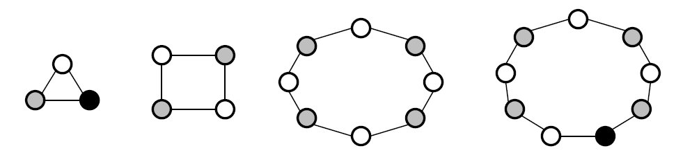
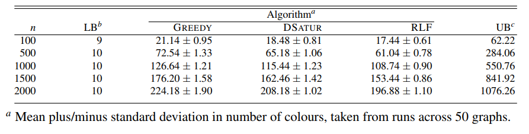
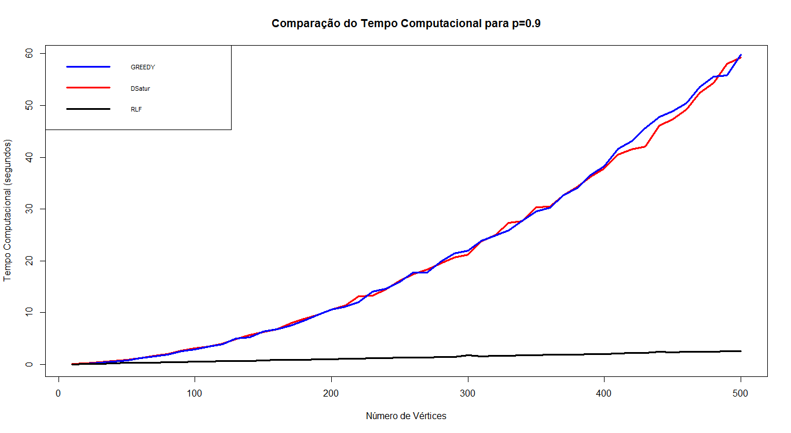

## 1. Introdução do Problema ##

Seja um grafo $G=(V,E)$ com $n=|V|$ vértices e $m=|E|$ arestas. O problema de coloração de grafos consiste em atribuir a cada vértice $v \in V$ um inteiro $c(v) \in \{1,2,..,k\}$, que representa uma cor, e que:  

- $c(v) \neq c(u)$ $\forall$ $\{v,u\} \in E$. Vértices adjacentes não podem ser associados a mesma cor;

- $k$ é mínimo. A solução ideal é colorir os vértices utilizando o menor número de cores possíveis, respeitando a condição anterior.

Um exemplo de Coloração de Grafos é:

<center>{width=600px}</center>
*Figura 1: Uma coloração ótima (LEWIS p.1)*

É importante ressaltar que para tratar o problema são feitas as seguintes suposições:

- O grafo $G$ é **conexo**. Caso contrário, tratar cada componente conexa separadamente;

- $G$ é um grafo **simples**: o Grafo não contém *loops* ou *multiarestas* e é *não-direcionado*;

- Serão discutidos problemas relacionados à **Coloração de Vértices** do Grafo. Existem, tembém, problemas relacionados à Coloração de Arestas, mas não serão tratados nesse texto. Dessa forma, o problema de **Coloração de Vértices** será mencionado como **Coloração de Grafos** daqui em diante.

Existem muitas aplicações do problema de Coloração de Grafos como: 

- Colorir mapas: cada região territorial demarcada representa um vértice e regiões com fronteira são adjacentes;

- Resolver jogos *Sudoku*: célula representa um vértice e vértices da mesma linha e coluna, assim como vértices da mesma grade (3x3) são adjacentes; cada número de 1 a 9 é representado por uma cor.

- Construir horários para aulas ou eventos; de modo que cada aula seja um vértice e aulas/palestras que não podem ocorrer ao mesmo tempo são adjacentes. Cada cor representa um horário.

- Constuir escalas para taxis ou ônibus; de modo que cada viagem marcada com horário de início e retorno à estação seja um vértice e viagens com interseção no tempo de viagem são adjacentes. Cada taxi/ônibus é representado por uma cor.

- Verificar se um grafo é **Bipartido**. Será visto que grafos Bipartidos possuem uma característica exclusiva no problema de Coloração.

Muitos outros problemas podem ser tratados como problemas de Coloração de Grafos a partir do momento em que se enxerga tal problema como uma partição de elementos em grupos por meio de uma restrição (presença de aresta).

## 2. Definições ##

Para introduzir alguns algoritmos construtivos para o problema são necessárias algumas definições:

- Uma coloração é **possível** se, e somente se, todos os vértices $v$ estão associados a uma cor e vértices adjacentes estejam associados a diferentes cores;

- O **número cromático** de um grafo é $\chi(G)=k$, em que $k$ é mínimo. Uma coloração **possível** de $G$ usando exatamente $\chi(G)=k$ cores é considerada **ótima**;

- Uma **classe de cor** é um conjunto de vértices associados à mesma cor: $\{v \in V:c(v)=i\}$;

- Um **conjunto independente** é um subconjunto de vértices $I\subseteq V$ tal que nenhum par é adjacente: $\forall \, u,v \in I, \{u,v\}\notin E$;

- Um **clique** é um subconjunto de vértices $C \subseteq V$ tal que todos, tomados dois a dois, são adjacentes: $\forall \, u,v \in C, \{u,v\}\in E$;

- A **vizinhança** de um vértice $v$ é dada pelo conjunto contendo seus vértices adjacentes: $\Gamma(v)=\{u \in V: \{u,v\}\in E\}$;

- O **grau** de um vértice $v$ é dado pelo seu número de vizinhos: $deg(v)=||\Gamma(v)||$.

## 3. Complexidade do Problema ##

Em geral, encontrar uma coloração que seja ótima para um grafo $G$ é um problema *NP-hard*. O espaço de soluções é muito grande e cresce rapidamente ao se aumentar o número de vértices. Dessa forma, algoritmos construtivos, heurísticos e meta-heurísticos são mais utilizados para resolver problemas dessa natureza por serem mais simples e menos custosos computacionalmente. Contudo, tais algoritmos apresentam **soluções subótimas**. O que significa que mesmo que a solução seja ótima, muito possivelmente não será possível provar que isso é verdade. A qualidade da solução dependerá muito do grafo e do algoritmo escolhido.  
Ainda assim, dependendo do tipo de Grafo, a solução ótima é trivial, ou seja, o número cromático $\chi(G)$ é fácil de ser obtido.

## 3.1. Grafos Completos ##
 
Um grafo com $n$ vértices é completo ($K_n$) se cada vértice é adjacente aos demais: $\forall \,\, u,v \in V(K_n), \{u,v\} \in E(K_n)$. Sendo assim, é fácil ver que $\chi(K_n)=n$, uma vez que sempre que um vértice é colorido nenhum outro poderá ser associado a essa mesma cor.

<center>{width=500px}</center>
*Figura 2: Coloração ótima para os grafos $K_1, K_2, K_3, K_4 \,e\, K_5$ respectivamente (LEWIS p.18)*

### No *software* $R$ - *igraph* ###

Para verificar se um grafo é completo e calcular seu número cromático é fácil ao se utilizar o pacote *igraph*:
```{r message=FALSE, warning=FALSE, fig.width=2, fig.height=2, fig.align='center'}
library(igraph) # Carregando pacote igraph

g <- make_full_graph(5) # Criando um grafo completo K5

par(mar=c(0,0,0,0)) ; plot(g, edge.color="black")

length(max_cliques(g)[[1]]) == length(V(g)) # O grafo é completo?

length(V(g)) #Nº cromático
```

A função *max_cliques* calcula os maiores subgrafos completos do grafo dado. Se o grafo é completo, o maior subgrafo vai ser o próprio grafo e o número cromático será o número de vértices dele.

## 3.2. Grafos Bipartidos ##

Um grafo $G=(V_1,V_2,E)$ é bipartido se os vértices podem ser particionado em dois grupos de modo que um vértice de um grupo só pode ser adjacente a um vértice do outro grupo: se $u,v \in V_i \,\,\forall\,\, i=1,2$, então $\{u,v\} \notin E$.  
Essa partição natural dos vértices separa os mesmos em duas classes de cor por sua própria definição. Então é evidente que o número cromático de um grafo bipartido é $\chi(G)=2$. Dessa forma, se $\chi(G)=2$, o grafo $G$ é Bipartido.

<center>{width=500px}</center>
*Figura 3: Coloração ótima para alguns exemplos de grafos bipartidos (LEWIS p.19)*

Grafos Bipartidos englobam grafos cíclicos pares, grafos-árvore, e estrelas.

### No *software* $R$ - *igraph* ###

Uma simples função do pacote *igraph* nos diz se um grafo é bipartido ou não.
```{r, fig.width=2, fig.height=2, fig.align='center'}
g <- make_bipartite_graph( rep(0:1,length=10), c(1:10)) # criando um grafo bipartido

par(mar=c(0,0,0,0)) ; plot(g,layout=layout.bipartite, edge.color="black")

bipartite.mapping(g)$res # Grafo é bipartido?
```

## 3.3. Grafos Cíclicos ##

Um grafo $C_n$ com $n$ vértices $V(C_n)=\{v_1,...,v_n\}$ é dito Cíclico se os seus vértices são adjacentes de modo que o primero é adjacente ao segundo, o segudo ao terceiro e assim sucessivamente até o último, finalmente, ser adjacente ao primeiro: $E(C_n)=\{\{v_1,v_2\},\{v_2,v_3\},...,\{v_{n-1},v_n\},\{v_n,v_1\}\}$.  
Se $n$ for par é possível colorir os vértices alternando duas cores, uma para cada vértice na sequência. Se $n$ for ímpar o mesmo procedimento é adotado, porém o último vértice da sequência é adjacente a dois vértices: cada um associado a uma das duas cores, então uma terceira cor deverá ser usada para ele. Dessa forma, se $n$ é par: $\chi(C_n)=2$; se $n$ é ímpar: $\chi(C_n)=3$.

<center>{width=500px}</center>
*Figura 4: Coloração ótima para os grafos $C_3,C_4,C_8 \,e\, C_9$ respectivamente (LEWIS p.19)*

### No *software* $R$ - *igraph* ###

Uma outra função do pacote *igraph* nos permite verificar se um grafo é cíclico:

```{r, fig.width=2, fig.height=2, fig.align='center'}
g <- graph.ring(10) # criando o grafo C10
par(mar=c(0,0,0,0)) ; plot(g, edge.color="black")
girth(g)$girth == length(V(g)) # O grafo é cíclico?
length(V(g)) #Se par: Nº cromático = 2, Se ímpar: Nº cromático = 3
```

A função *girth* calcula o número de vértices do menor subgrafo cíclico do grafo dado. Se o grafo for cíclico, então o menor subgrafo cíclico é o próprio grafo e o número de vértices do grafo é igual ao dado pela função *length(V())*.

## 4. Algoritmos Construtivos ##

Serão apresentados 3 algoritmos construtivos para o problema de coloração de grafos juntamente com suas implementações no *software* $R$ construídas por mim e algumas já existentes disponíveis para serem utilizadas.  
Tais algortimos são simples, intuitivos e de construção relativamente fácil.

## 4.1. Algoritmo GREEDY ##

Nesse primeiro algortimo, o mais simples de todos, toma-se um vértice por vez em uma determinada sequência e lhe atribui a primeira cor ou primeira classe de cor disponível.

<center>{width=500px}</center>
*Figura 5: Algoritmo GREEDY em um grafo $G$ dado a sequência = $v_1, v_2,..., v_8$ (LEWIS p.30)*

### No *software* $R$ - *igraph*: Algoritmo GREEDY ###

Utilizando algumas funções do pacote *igraph* e, claro, dado um grafo $G$ da classe *igraph* foi possivel construir a seguinte função que retorna a relação das classes de cor e o número de classes formadas. A sequência dos vértices pode ser alterada.

```{r}
vertex.color.greedy <- function(g, seq=V(g)){
    grps <- list()
    for(i in seq){
      if(length(grps)==0){grps[[1]]<-i}else{
        for(j in 1:length(grps)){
          if(sum(grps[[j]]%in%neighbors(g,i))==0){grps[[j]]<- c(grps[[j]],i);break}
        }
        if(sum(i%in%unlist(grps))==0){grps[[(length(grps)+1)]] <- i}
      }
    }
  grps2 <- list(no._de_grupos=length(grps),grupos=grps)
  return(grps2)
}
```

O Algoritmo *GREEDY* produz sempre e rapidamente uma solução **possível**. No entanto pode ser pobre quanto ao número de grupos formados em relação ao número cromático $\chi(G)$.  
Um teorema interressante em relação a esse algortimo é:

**Teorema:** Seja $S$ uma solução **possível** para $G$. Se cada classe de cor $S_i \in S$ é considerada por vez no algoritmo *GREEDY*, a solução resultante $S'$ será tal que $|S'| \leq |S|$.  

A prova desse teorema é intuitiva e fácil de se ver ao observar os passos do algoritmo. Então vejamos um exemplo:  

**Exemplo:**  

Seja uma solução: $S=\{S_1,S_2,S_3,S_4\}=\{\{v_1,v_5,v_6\},\{v_2,v_3,v_8\},\{v_4\},\{v_7\}\}$ para um grafo $G$.  
No pior dos casos:  
$S'_1=\{v_1,v_5,v_6\}$  
$S'_2=\{v_2,v_3,v_8\}$  
$S'_3=\{v_4\}$  
$S'_4=\{v_7\}$  
$|S'|=|S|$

Ou seja, na pior das hipóteses, nenhum vértice $v_l \in S_j$ vai poder ser inserido em outra classe de cor $S_i$ em que $i<j$. E assim, o número de classes de cor não se altera na nova solução. No melhor dos casos, os vértices de uma determinada classe poderão ser re-associados para outras classes e, assim, se ter uma nova solução com um número menor de classes formadas.  
Importante ressaltar que, em $S$, a ordem das classes pode ser aleatorizada, assim como a ordem dos vértices dentro de cada classe na busca por uma solução melhor.  
Assim, dada uma sequência específica, é fácil ver que o algortimo *GREEDY* obterá a solução ótima. Tendo em vista isso, reconstruí o algoritmo com uma alteração: ao obter uma solução, a ordem das classes e a ordem dos vértices dentro de cada classe é aleatorizada para obter uma nova sequência e esta é colocada no algoritmo. Esse procedimento é realizado o número especificado de vezes e pode trazer grandes ganhos. Claro que, quando o procedimento é repetido uma grande quantidade de vezes, há um grande custo computacional.

### No *software* $R$ - *igraph*: Algoritmo GREEDY Alternativo ###

```{r}
vertex.color.greedy.2 <- function(g, seq=V(g),times=1){
  n=0
  while(n<times){
    grps <- list()
    for(i in seq){
      if(length(grps)==0){grps[[1]]<-i}else{
        for(j in 1:length(grps)){
          if(sum(grps[[j]]%in%neighbors(g,i))==0){grps[[j]]<- c(grps[[j]],i);break}
        }
        if(sum(i%in%unlist(grps))==0){grps[[(length(grps)+1)]] <- i}
      }
    }
    for(i in 1:length(grps)){ # Aleatorizar ordem dos vértices em cada classe
      if(length(grps[[i]])>1){grps[[i]] <- sample(grps[[i]])} 
    }
    seq <- unlist(sample(grps),use.names = F) # Aleatorizar ordem das classes
    n=n+1
  }
  
  grps2 <- list(no._de_grupos=length(grps),grupos=grps)
  return(grps2)
}
```

Apesar de ter construído uma função para o algoritmo, encontrei duas implementações prontas de variações do algortimo GREEDY no *software* $R$.  
A primeira utiliza o pacote *tmaptools* que só possui um algoritmo e necessita não do grafo em si, mas de uma lista de adjacência que é uma lista contendo vetores, cada um com os vizinhos de cada vértice. A função *map_coloring* recebe a lista e, acionada uma opção *minimize=TRUE*, ela encontra uma solução e tenta reduzi-la. Portanto, seus resultados são diferentes da função construída por mim, mas são resultados plausíveis, como pode-se ver a seguir.

### No *software* $R$ - *tmaptools*: Variação do Algoritmo GREEDY ###

```{r fig.align='center', fig.height=2.5, fig.width=2.5, message=FALSE, warning=FALSE}
set.seed(21)
g <- erdos.renyi.game(10, 20, "gnm") # Gerando grafo com 10 vértices e 20 arestas
g1 <- as_adj_list(g) # Lista de adjacência

library(tmaptools)
tmap.col <- map_coloring(g1, algorithm = "greedy", minimize=TRUE)
tmap.col # Solução encontrada
par(mar=c(0,0,0,0))
plot(g, vertex.color=c('red','blue','green','yellow')[tmap.col], edge.color="black",
     vertex.label.color="black")
```

A segunda implementação requer um pacote que já não está disponível no repositório padrão do *software* $R$, o *CRAN*. Portanto, é necesário instalar o pacote *RBGL* por meio de outro pacote *BioCManager*. Além disso, a função *sequential.vertex.coloring* recebe um grafo da classe *graph*. Apesar disso, sua solução é similar a da função construída por mim. Como veremos a seguir.

### No *software* $R$ - *RBGL*: Algoritmo GREEDY ###

```{r message=FALSE, warning=FALSE}
set.seed(69)
g <- erdos.renyi.game(15, 30, "gnm") # Criando grafo com 15 vértices e 30 arestas
class(g) # classe do grafo g

library("BiocManager")
```
```{r eval=FALSE, message=FALSE, warning=FALSE}
BiocManager::install("RBGL", version = "3.8")
```
```{r}

g1 <- graph::graphAM(get.adjacency(g, type="both", sparse = F),edgemode = "undirected") 
class(g1) # Transformando grafo da classe igraph para graph

RBGL::sequential.vertex.coloring(g1) # Coloração da função sequential.vertex.coloring
vertex.color.greedy(g)$grupos # Coloração da minha função
```

## 4.2. Limites para $\chi(G)$ ##

A partir do algoritmo GREEDY é possível construir limites para o número cromático $\chi(G)$.

**Limite Inferior**  
Se o grafo $G$ possui subgrafo completo *(clique)* $K_h$, será preciso ao menos $h$ cores para se colorir o subgrafo e, consequentemente, para se colorir todo o grafo. Logo $\chi(G) \geq h$.

<center>{width=500px}</center>
*Figura 6: Limite inferior para o número cromático: $\chi(G) \geq 5$ (LEWIS p.2)*

**Limite Superior**  
Se o grafo $G$ tem grau máximo $\Delta(G)$, isto é, $\Delta(G)=max\{deg(v): v \in V\}$. Então $\chi(G) \leq \Delta(G)+1$.  
A prova é dada pelo algoritmo GREEDY: Considere o i-ésimo vértice na sequência $v_i$. No pior dos casos, esse vértice tem $\Delta(G)$ vizinhos e cada um deles já está em um grupo de cor diferente, ou seja, já se tem $\Delta(G)$ classes de cor formadas. Então cria-se mais uma classe de cor para $v_i$. Tem-se então $\Delta(G)+1$ classes de cor.  
Esse limite superior, contudo, é facilmente inflacionado pela presença de um vértice mais conectado que os outros. Podendo ficar muito maior que o verdadeiro valor do número cromático.

### No *software* $R$ - *igraph*: Limites para $\chi(G)$ ###

Usando funções do pacote *igraph* é possível construir os limites apresentados para o número cromático $\chi(G)$ para um grafo $G$.

```{r fig.width=2, fig.height=2, fig.align='center'}
set.seed(69)
g <- sample_gnm(10,15,directed = F,loops = F) # Criando grafo de 10 vértices e 15 arestas
par(mar=c(0,0,0,0)) ; plot(g, edge.color="black")
max(sapply(cliques(g),length)) #chomatic number >= 3
max(degree(g)) + 1 #chomatic number <= 5
```

A função *cliques* calcula todos os subgrafos completos do grafo dado, então seleciona-se o número de vértices do maior deles. A função *degree* oferece o grau de cada vértice do grafo dado. A soma do maior deles com 1 nos dá o limite superior. Então:
$3 \leq \chi(G) \leq 5$.

## 4.3. Algoritmo DSatur ##

Para apresentar o segundo algoritmo construtivo é necessária uma nova definição:  
O **grau de saturação** de um vértice não colorido $v \in V$ tal que $c(v)=NULL$ é dado pelo número de cores diferentes associadas aos vizinhos dele: $sat(v)=||c(u):u \in \Gamma(v) \wedge c(u) \neq NULL||$.  
O algoritmo DSatur é similar ao GREEDY, entretanto, a geração da ordem dos vértices na sequência prioriza os vértices com menor opção de cores disponíveis, ou seja, com maior grau de saturação.  
Nos casos de empate no maior grau de saturação, prioriza-se o de maior grau. Em caso de novo empate sorteia-se aleatoriamente entre os empatados.  
Inicialmente, todos os vértices tem $sat = 0$, então começa-se com o vértice de maior grau.

<center>{width=500px}</center>
*Figura 7: Algoritmo DSatur em um grafo $G$ (LEWIS p.40)*

### No *software* $R$ - *igraph*: Algoritmo DSatur ###

A construção é similar a do algoritmo GREEDY utilizando funções do pacote *igraph* e um grafo $G$ da classe *igraph*. Esse algoritmo tem uma perda em custo computacional ao se recalcular, em cada passo, os graus de saturação.

```{r}
vertex.color.dsatur <- function(g){
  grps <- list()
  verts <- V(g)
  d.satur <- rep(0,times=length(verts))
  while(length(verts)!=0){
    d <- data.frame(as.vector(verts),d.satur,deg=degree(g,verts))
    seq <- d[order(d$d.satur,d$deg,decreasing=T),1]
    for(i in seq){
      if(length(grps)==0){grps[[1]]<-i;verts<-verts[verts!=i]}else{
        for(j in 1:length(grps)){
          if(sum(grps[[j]]%in%neighbors(g,i))==0){
            grps[[j]]<- c(grps[[j]],i);verts<-verts[verts!=i];break}
        }
        if(sum(i%in%unlist(grps))==0){
          grps[[(length(grps)+1)]] <- i;verts<-verts[verts!=i]}
      }
    }
    d.satur <- c()
    for(i in verts){
      s <- 0
      for(j in grps){
        if(sum(j%in%neighbors(g,i))>0){s <- s+1}}
      d.satur <- c(d.satur,s)}}
  grps2 <- list(no._de_grupos=length(grps),grupos=grps)
  return(grps2)}
```

## 4.4. Algoritmo RLF ##

O terceiro e último algoritmo a ser apresentado é o RLF que adota uma estratégia diferente: Forma-se uma classe de cor por vez.  
No i-ésimo passo a classe de cor $S_i$ é construída: inicialmente um vértice $v$ é selecionado e adicionado à classe de cor. Então, dentre os vértices restantes que podem ser adicionado à classe, escolhe-se o próximo vértice. O algoritmo prossegue até não se ter mais opções de vértices. No próximo passo a classe $S_{i+1}$ é construída.  
Todas as seleções de vértices são feitas aleatoriamente.

<center>{width=500px}</center>
*Figura 8: Algoritmo RLF em um grafo $G$ (LEWIS p.44)*

### No *software* $R$ - *igraph*: Algoritmo RLF ###

Mais uma vez, construí o algoritmo utilizando funções do pacote *igraph*.

```{r}
vertex.color.RLF <- function(g){
  grps <- list()
  while(sum(V(g)%in%unlist(grps))!=length(V(g))){
    X <- V(g)[!V(g)%in%unlist(grps)]
    grp.new <- c()
    while(length(X)>0){
      if(length(X)==1){v<-X}else{v <- sample(X,1,replace=F)}
      grp.new <- c(grp.new,v)
      X <- X[X!=v]
      X <- X[!X%in%neighbors(g,v)]
    }
    grps[[length(grps)+1]] <- grp.new
  }
  grps2 <- list(no._de_grupos=length(grps),grupos=grps)
  return(grps2)
}
```

## 5. Exemplo: Colorindo o Brasil ##

Nesse exemplo usaremos uma das aplicações mais simples do problema de coloração de grafos: colorir mapas. Analisaremos as soluções de todos os algoritmos apresentados.

<center>{width=500px}</center>
*Figura 9: Mapa do Brasil (<https://icap.columbia.edu/where-we-work/brazil/)>*

O grafo do mapa do Brasil é construído usando funções do pacote *igraph*:

```{r, fig.align='center', fig.width=2.5, fig.height=2.5}
brasil_map <- graph.formula(AM-AC:RR:RO:PA:MT, AC-RO, RR-PA, RO-MT, PA-AP:MT:TO:MA, 
                            TO-MT:GO:MA:PI:BA, DF-GO:MG, MT-GO:MS, GO-MS:BA:MG, 
                            MS-MG:SP:PR, MA-PI, PI-CE:PE:BA, RN-CE:PB, CE-PB:PE,
                            PB-PE, PE-AL:BA, AL-SE:BA, SE-BA, BA-MG:ES, ES-MG:RJ,
                            MG-RJ:SP, RJ-SP, SP-PR, PR-SC, SC-RS)

set.seed(88)
par(mar=c(0,0,0,0))
plot(brasil_map, vertex.shape="rectangle", edge.width=5, edge.color="black",
       vertex.color="darkblue", vertex.label.color="white")
```

Primeiramente, construiremos limites para o número cromático do grafo usando as funções apresentadas anteriormente:

```{r}
c(lower=max(sapply(cliques(brasil_map),length)), upper=max(degree(brasil_map)) + 1)
```

Temos que $3 \leq \chi(G) \leq 9$.  
São observáveis alguns triângulos ($K_3$) e o estado da Bahia (BA) faz fronteira com 8 outros estados. Já vemos que o limite superior cresce consideravelmente.

### GREEDY ###

```{r, fig.align='center', fig.width=2.5, fig.height=2.5}
set.seed(1)
brasil.greedy <- vertex.color.greedy(brasil_map, sample(V(brasil_map)))
brasil.greedy

cores <- c("red","blue","green","yellow","white")
for(i in 1:brasil.greedy$no._de_grupos){
  V(brasil_map)$color[V(brasil_map)%in%brasil.greedy$grupos[[i]]] <- cores[i]
}
set.seed(88)
par(mar=c(0,0,0,0))
plot(brasil_map, vertex.shape="rectangle", edge.width=5, 
     edge.color="black", vertex.label.color="black")
```

### DSatur ###

```{r, fig.align='center', fig.width=2.5, fig.height=2.5}
set.seed(9)
brasil.dsatur <- vertex.color.dsatur(brasil_map)
brasil.dsatur

for(i in 1:brasil.dsatur$no._de_grupos){
  V(brasil_map)$color[V(brasil_map)%in%brasil.dsatur$grupos[[i]]] <- cores[i]
}
set.seed(88)
par(mar=c(0,0,0,0))
plot(brasil_map, vertex.shape="rectangle", edge.width=5,
     edge.color="black", vertex.label.color="black")
```

### RLF ###

```{r, fig.align='center', fig.width=2.5, fig.height=2.5}
set.seed(100)
brasil.rlf <- vertex.color.RLF(brasil_map)
brasil.rlf

for(i in 1:brasil.rlf$no._de_grupos){
  V(brasil_map)$color[V(brasil_map)%in%brasil.rlf$grupos[[i]]] <- cores[i]
}
set.seed(88)
par(mar=c(0,0,0,0))
plot(brasil_map, vertex.shape="rectangle", edge.width=5,
     edge.color="black", vertex.label.color="black")
```

### GREEDY Alternativo ###

```{r, fig.align='center', fig.width=2.5, fig.height=2.5}
set.seed(1)
brasil.greedy2 <- vertex.color.greedy.2(brasil_map, sample(V(brasil_map)), times=10)
brasil.greedy2

for(i in 1:brasil.greedy2$no._de_grupos){
  V(brasil_map)$color[V(brasil_map)%in%brasil.greedy2$grupos[[i]]] <- cores[i]
}
set.seed(88)
par(mar=c(0,0,0,0))
plot(brasil_map, vertex.shape="rectangle", edge.width=5,
     edge.color="black", vertex.label.color="black")
```

### Pacote 'tmaptools' - GREEDY ###

```{r, fig.align='center', fig.width=2.5, fig.height=2.5}
set.seed(3)
brasil_map2 <- as_adj_list(brasil_map)
brasil.tmap <- map_coloring(brasil_map2, algorithm = "greedy", minimize = TRUE)
brasil.tmap
max(brasil.tmap)

set.seed(88)
par(mar=c(0,0,0,0))
plot(brasil_map, vertex.shape="rectangle", edge.width=5, edge.color="black",
     vertex.label.color="black", vertex.color=cores[brasil.tmap])
```

Vemos que todos os algoritmo, exceto o *GREEDY*, encontraram uma solução com 4 cores. Contudo, ao se utilizar a versão alternativa do mesmo a fim de se reduzir o número de cores da solução (recalculando a solução 10 vezes) obteve-se uma nova solução com, também, 4 cores.

## 6. Comparação dos Algoritmos ##

## 6.1. Algortimos em C++ ##

No livro de referência principal desse trabalho (LEWIS) foi feita uma comparação empírica dos 3 algoritmos (GREEDY, DSatur e RLF) construídos na linguagem C++ e disponibilizados pelo autor. Gerou-se aleatoriamente grafos ao se variar o número de vértices e a densidade do grafo (probabilidade de existência de cada aresta). Foi observada a performance dos algoritmos tanto em número de cores da solução quanto em número de checagens para alocar vértices. As conclusões foram:

- O algoritmo que, em geral, obteve soluções com um menor número de cores foi o *RLF*, seguido pelo *DSatur* e, por último, o *GREEDY*;
- Os algoritmos *GREEDY* e *DSatur* foram similares na exigência computacional, mas o *RLF* foi o que mais exigiu da máquina, com o valor de checagens explodindo para grafos muito densos.

<center>{width=600px}</center>
*Figura 10: Sumário dos resultados produzidos pelos 3 algoritmos ao se gerar 50 grafos para diferentes tamanhos e densidade de 0.5. (LEWIS p.48)*

Na *Figura 10* são construídos intervalos de confiança para o número de cores das soluções. Sendo a média do número de cores +/- o desvio padrão obtido.

## 6.2. Algoritmos em R ##

Pela diferença de linguagem e, claro, pela forma de construção dos algoritmos, eram esperadas certas diferenças entre a comparações dos algortimos contruídos no $R$ e a comparação feita pelo autor. A comparação feita por mim limitou-se a gerar grafos aleatórios variando o número de vértices de 10 a 500 (10 em 10), ou seja, 50 grafos, para três densidades diferentes $(p=0.2, 0.5, 0.9)$, e submeter às três funções cada um dos grafos medindo o tempo computacional para computar o resultado e o número de cores das soluções.  

<center>{width=500px}</center>
*Figura 11: Número de cores das soluções para os 3 algoritmos e densidade p=0.2*

<center>{width=500px}</center>
*Figura 12: Número de cores das soluções para os 3 algoritmos e densidade p=0.5*

<center>{width=500px}</center>
*Figura 13: Número de cores das soluções para os 3 algoritmos e densidade p=0.9*

Quanto ao número de cores das soluções, vê-se nas *Figuras 11, 12 e 13*, os 3 algoritmos foram bem similares com o *DSatur* apresentando resultados um pouco melhores para grafos com um maior número de vértices.

<center>{width=500px}</center>
*Figura 14: Tempos computacionais para os 3 algoritmos e densidade p=0.2*

<center>{width=500px}</center>
*Figura 15: Tempos computacionais para os 3 algoritmos e densidade p=0.5*

<center>{width=500px}</center>
*Figura 16: Tempos computacionais para os 3 algoritmos e densidade p=0.9*

Pelas *Figuras 14, 15 e 16*, é visível como o algoritmo *RLF* foi bem mais veloz que os demais. Além disso, a *Figura 17* mostra que o tempo computacional do algoritmo *RLF* não cresce tanto quando o grafo é mais denso, diferentemente do que acontece com os algoritmos *DSatur* e *GREEDY*.

<center>{width=500px}</center>
*Figura 17: Tempos computacionais para o algoritmo RLF nas 3 densidades*

## 7. Outros Algoritmos ##

No texto-referência (LEWIS) são apresentados diversos algoritmos mais complexos que adotam diferentes estratégias para a resolução de problemas de coloração dos grafos, como:

- **Algoritmos Exatos**: Sempre obtêm solução ótima (sem tempo limite de execução ou outro critério de parada).  
- **Algoritmos Heurísticos e Metaheurísticos**: Adaptáveis a diferentes problemas e geralmente apresentam bons resultados para grafos com grande número de vértices.

São discutidas, ainda, aplicações e extensões do problema (como o problema de coloração de arestas). Além de problemas práticos do mundo real.

## 8. Referências ##

LEWIS, R.M.R. A Guide to Graph Colouring: Algorithms and Applications. Springer International Publishing Switzerland, 2016.  

CRAN. Igraph: Network Analysis and Visualization. Disponível em: <https://cran.r-project.org/web/packages/igraph/index.html>   

CRAN. tmaptools: Thematic Map Tools. Disponível em <https://cran.r-project.org/web/packages/tmaptools/index.html>  

CRAN. BiocManager: Access the Bioconductor Project Package Repository. Disponível em: <https://cran.r-project.org/web/packages/BiocManager/index.html>  

Bioconductor. RBGL: An interface to the BOOST graph library. Disponível em: <http://www.bioconductor.org/packages/release/bioc/html/RBGL.html>   

Bioconductor. Graph: A package to handle graph data structures. Disponível em: <http://www.bioconductor.org/packages/release/bioc/html/graph.html>
