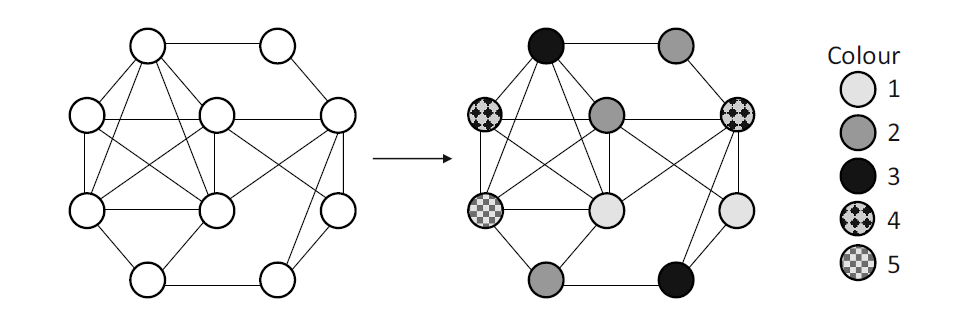

```{r setup, include=FALSE}
knitr::opts_chunk$set(echo = FALSE)
```

## Descrição do Problema
Seja um grafo $G=(V,E)$ com $n$ vértices $\in V$ e $m$ arestas $\in E$. O problema de coloração de grafos consiste em atribuir a cada vértice $v \in V$ um inteiro $c(v) \in \{1,2,..,k\}$ em que:  


- $c(v) \neq c(u) \,\forall\, \{v,u\} \in E$.
- $k$ é mínimo.

### Observações:

- Supõe-se que o grafo $G$ é **conexo**.
- $G$ é **simples**.
- Serão apresentados problemas relacionados à **coloração dos vértices**.

---
### Exemplo:

<center>{width=800px}</center>

$\Rightarrow$ É importante enxergar o problema de coloração de grafos como um problema de partição dos vértices em grupos que devem ser formados de acordo com uma restrição (presença de aresta).  
  
  
$\Rightarrow$ O problema será apresentado juntamente com 3 algoritmos mais simples para resolução do mesmo.

$\Rightarrow$ Não há implementações dos algoritmos já feitas no *software* $R$, mas são de construção relativamente simples.

## Aplicações:
- Colorir mapas;
- Resolver jogos *Sudoku*;
- Construção de Horários (aulas, eventos, etc);
- Agendamentos (taxis, aviões, etc);
- Alocação de assentos em eventos;
- Verificar se um grafo é bipartido;
- Entre outros problemas que podem ser abordados como problemas de coloração de grafos.

----
### Colorindo um mapa:
<center>{width=500px}</center>

## Referência:

- LEWIS, R.M.R. A Guide to Graph Colouring: Algorithms and Applications. Springer International Publishing Switzerland, 2016. (Cap 1 e 2)

<center>{width=280px}</center>